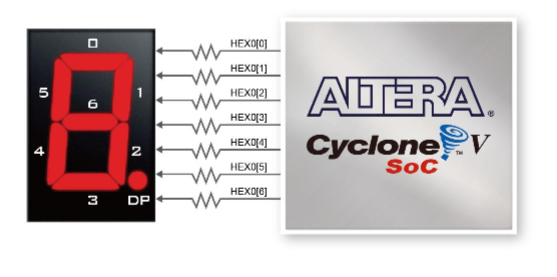

# SystemVerilog 7-Segment Display Driver for Intel Cyclone V FPGA

7-Segment displays are active LOW and have LEDs indexed as below:

# Modules
- `seg7a`: displays a single alphabet (to the best of its abilities). Excludes M, W and X. Control with `seg7_a_t` enum in the `seg7` package.  
- `seg7b`: displays a single bit
- `seg7o`: displays a single octal digit
- `seg7x`: displays a single hexadecimal digit

# Use
Single file library. Simply copy `seg7.sv` to wherever desired.

# Examples
See `DE1_SoC.sv`, which consists of the 4 modules driving a 7-segment display each, incremented by push button signals and with reset switch. Should be synthesizable and ModelSim-compatible.  